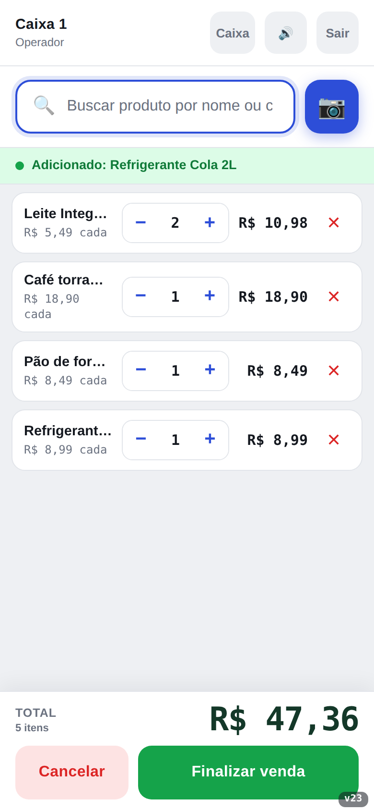
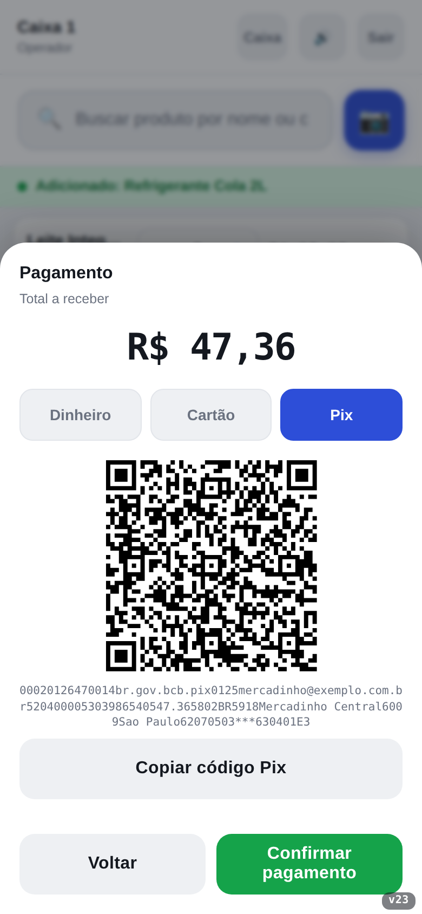
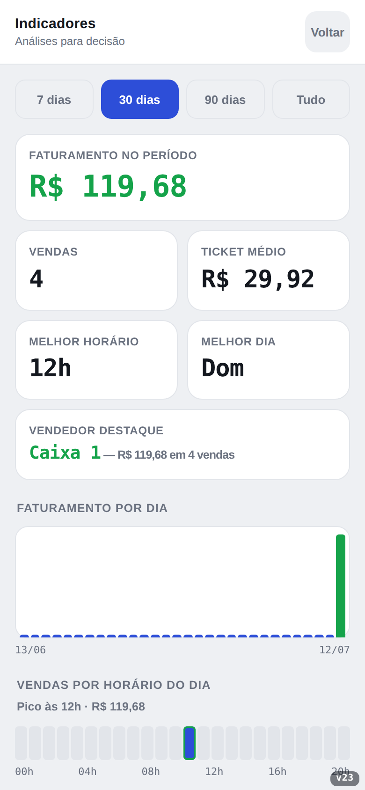

# PDV · Caixa Rápido

Ponto de venda (PDV) mobile, leve e **100% client-side**, com leitor de código de
barras pela câmera, controle de estoque e relatórios de vendas. Funciona como
**PWA**: dá para instalar no celular e usar **offline**.

> Aplicativo de uma página (SPA) em HTML/CSS/JavaScript puro, sem build e sem backend.

## Funcionalidades

- **Login** com perfis de **operador** (caixa) e **gerência**.
- **Caixa**: leitura de código de barras pela câmera (**BarcodeDetector nativo**
  quando disponível, com fallback para html5-qrcode e teclado manual), suporte a
  **leitor físico USB/Bluetooth** (modo teclado), carrinho com ajuste de
  quantidade e validação de estoque.
- **Pagamento**: Dinheiro (com cálculo de **troco**), Cartão e **Pix com QR Code
  e "copia e cola" gerados no aparelho** (BR Code EMV com o valor da venda —
  basta a gerência cadastrar a chave Pix; sem backend e sem taxas), com
  **comprovante** imprimível e **compartilhável** (WhatsApp etc.).
- **Controle de caixa**: abertura com **fundo de troco**, **sangria** e
  **reforço**, fechamento com **conferência** (esperado × contado) e histórico
  de fechamentos na gerência.
- **Gerência**:
  - Estoque: cadastrar, **editar nome/preço/quantidade** e **excluir** produtos,
    com **busca** e **alerta de estoque baixo configurável**.
  - **Controle de validade**: cada produto pode ter uma **data de validade**;
    o app destaca itens **vencidos** e **a vencer**, mostra um **resumo no topo
    do estoque** e permite ajustar **com quantos dias de antecedência** avisar.
  - Vendas: **histórico com filtro por data**, totais do período, **ticket
    médio**, **curva ABC** dos produtos (com **lucro** quando o custo do produto
    é informado) e **exportação para CSV**.
  - Estoque: aviso de **reposição** ("estoque para ~X dias") calculado pela
    média de vendas dos últimos 14 dias.
  - **Backup**: exportação/importação de todos os dados em JSON.
  - Usuários: **cadastrar caixas e gerentes**, definir login/senha e conceder a
    **permissão de adicionar itens ao estoque** a cada caixa (com remoção de
    usuários e travas para não excluir a si mesmo nem o último gerente).
- **Reposição pelo caixa**: o operador com a permissão liberada ganha o botão
  **"+Estoque"** para lançar entradas de mercadoria em produtos já cadastrados,
  podendo informar a **validade da mercadoria que entrou**.
- **Persistência**: `localStorage` (ou `window.storage` em ambiente de artifact);
  cai para memória apenas se nenhum estiver disponível (com aviso na tela).
- **Sessão persistente** e **sincronização entre abas**.

## Capturas de tela

<p align="center">
  
  
  
</p>

Mais telas em [`divulgacao/img/`](divulgacao/img/). Para apresentar o app,
publique junto a página [`divulgacao/index.html`](divulgacao/index.html)
(landing page) e use os textos prontos do
[kit de divulgação](divulgacao/kit-divulgacao.md).

## Como usar

Abra o `pdv-mobile.html` por um servidor **HTTP(S)** (necessário para câmera,
service worker e instalação como app). Exemplos:

```bash
# Python
python3 -m http.server 8080
# depois acesse http://localhost:8080/pdv-mobile.html
```

Ou publique numa hospedagem estática (ex.: **GitHub Pages**) e acesse a URL.

### Credenciais de demonstração

| Perfil    | Usuário   | Senha |
|-----------|-----------|-------|
| Gerência  | `gerente` | `1234`|
| Caixa     | `caixa`   | `1234`|

## Modo SaaS (opcional): loja na nuvem

Por padrão o app é 100% local. Preenchendo uma configuração, ele passa a
**sincronizar estoque, vendas, caixa e usuários entre aparelhos** via
[Supabase](https://supabase.com) (plano gratuito) — sem servidor próprio.
O lojista **não vê nenhuma tela extra**: o aparelho usa o login de sempre
(usuário/senha) e a sincronização acontece por trás, de forma automática.

1. Crie um projeto grátis em supabase.com.
2. Em **Authentication → Sign In / Providers**, habilite **Anonymous
   Sign-Ins** (dá a cada aparelho uma identidade para o isolamento por
   empresa; não pede e-mail de ninguém).
3. No **SQL Editor**, execute o conteúdo de [`supabase/schema.sql`](supabase/schema.sql)
   (cria as tabelas, a função de login e o isolamento por empresa via
   Row Level Security).
4. Em **Settings → API**, copie a *Project URL* e a chave *anon public*
   para o arquivo [`js/config.js`](js/config.js) e publique o site.
5. Pelo **console do administrador** (abaixo), crie a empresa e cadastre
   ao menos um gerente. É só isso — na primeira vez que alguém digitar
   esse usuário/senha em qualquer aparelho, o app descobre sozinho a que
   empresa ele pertence e baixa os dados dela.

Por trás dos panos: quando o usuário digitado não existe ainda naquele
aparelho, o app consulta uma função no banco (`login_operator`) que
confere a senha com o mesmo hash já usado localmente e, se bater, vincula
o aparelho àquela empresa. Da próxima vez o login resolve local, sem ida
à nuvem. O app segue *offline-first*: opera local e sincroniza quando há
internet (última escrita vence; vendas são somadas, nunca sobrescritas).

### Console do administrador (`admin.html`)

Para quem opera o SaaS: a página **`admin.html`** é de onde você cria as
**empresas** e cadastra os **gerentes e caixas de cada uma** (criar
acesso, trocar senha, liberar reposição de estoque, remover, renomear a
empresa). Os aparelhos recebem as mudanças na sincronização seguinte.

O console também lista os **aparelhos conectados** de cada empresa e
permite **revogar** um vínculo (celular perdido, ex-funcionário etc.) —
o aparelho para de sincronizar já na próxima tentativa, sem apagar os
dados que ele já tinha localmente. Trocar a senha de um usuário, por si
só, não desconecta os aparelhos que ele já usou — revogue-os aqui se for
o caso.

O console tem seu próprio login (e-mail/senha real, só para você). Para
criar essa conta, use o painel do Supabase — **Authentication → Users →
Add user** (marque *Auto Confirm User*) — e depois promova-a a
administradora pelo SQL Editor:

```sql
insert into public.admins (user_id)
select id from auth.users where email = 'seu@email.com';
```

O acesso é garantido pelo banco (RLS): contas comuns não enxergam as
empresas alheias mesmo chamando a API diretamente, e só a função de
login pode vincular um aparelho a uma empresa (nunca o cliente direto).

### Instalar no celular (PWA)

Abra a URL no navegador do celular e use **"Adicionar à tela inicial"**. Após a
primeira visita, o app abre **offline**.

## Estrutura

| Arquivo                    | Função                                         |
|----------------------------|------------------------------------------------|
| `index.html`               | Redireciona a raiz para o app (URL limpa).      |
| `pdv-mobile.html`          | Casca do app: só o markup das telas.            |
| `css/pdv.css`              | Todo o estilo do app.                           |
| `js/config.js`             | Configuração da nuvem (vazia = modo local).     |
| `js/cloud.js`              | Sincronização com a nuvem (modo SaaS).          |
| `admin.html` / `js/admin.js` | Console do administrador da plataforma.       |
| `supabase/schema.sql`      | Esquema do banco para o modo SaaS.              |
| `js/helpers.js`            | Utilitários e versão do app.                    |
| `js/store.js`              | Camada de dados (storage, DB, sessão, boot).    |
| `js/feedback.js`           | Som, toast e faixa de status.                   |
| `js/auth.js`               | Navegação entre telas, login e senhas.          |
| `js/scanner.js`            | Leitor de código de barras (câmera/físico).     |
| `js/sale.js`               | Carrinho, pagamento, Pix e comprovante.         |
| `js/backup.js`             | Exportação/importação de dados em JSON.         |
| `js/manager.js`            | Gerência: estoque, validade, vendas, relatórios.|
| `js/users.js`              | Gerência: usuários e permissões.                |
| `js/cashbox.js`            | Caixa: abertura, sangria, fechamento, reposição.|
| `js/modals.js`             | Confirmação e teclado manual.                   |
| `js/main.js`               | Amarração de eventos, service worker e boot.    |
| `pdv-core.js`              | Núcleo de regras de negócio (puro, testável).   |
| `qrcode.min.js`            | Gerador de QR Code local (qrcode-generator, MIT).|
| `manifest.webmanifest`     | Metadados do PWA.                               |
| `sw.js`                    | Service worker (cache/offline).                |
| `icon-*.png`               | Ícones do app.                                  |
| `tests/`                   | Testes unitários (`npm test`) e E2E (Playwright).|
| `divulgacao/`              | Landing page, kit de divulgação e capturas de tela.|

Os módulos em `js/` são scripts clássicos com escopo global compartilhado,
carregados em ordem de dependência no fim do `pdv-mobile.html` — a
arquitetura continua **sem build e sem bundler**.

## Testes

```bash
# unitários (Node 20+, sem dependências)
npm test

# ponta a ponta (requer: npm i -D playwright, servidor local rodando)
python3 -m http.server 8899 &
npm run test:e2e   # PDV_URL e CHROMIUM_PATH são configuráveis por env
```

Roda automaticamente em cada push/PR via GitHub Actions
(`.github/workflows/tests.yml`) — os E2E do modo nuvem/admin usam um
Supabase falso em memória (`tests/e2e/fake-supabase.mjs`), sem precisar
de credenciais nem rede real.

## Limitações (por ser uma demo client-side)

- **Autenticação** é apenas demonstrativa (sem backend). As senhas são
  guardadas como **hash SHA-256** quando o navegador suporta (HTTPS ou
  `localhost` — o mesmo requisito da câmera), mas os dados continuam no
  cliente. Não use as credenciais padrão em produção.
- Os dados ficam **no dispositivo/navegador** — não há sincronização em nuvem
  nem entre aparelhos diferentes.
- A câmera exige **HTTPS** (ou `localhost`) e permissão do usuário.

## Tecnologias

- HTML/CSS/JS puro, sem dependências de build.
- [html5-qrcode](https://github.com/mebjas/html5-qrcode) (via CDN, com
  verificação de integridade **SRI**) para a leitura de código de barras.
